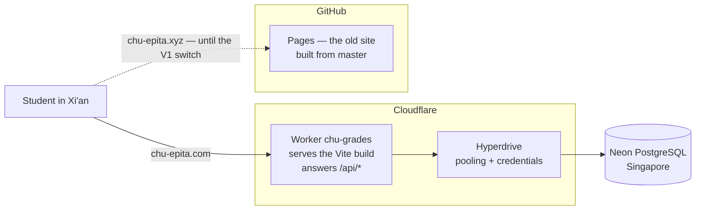
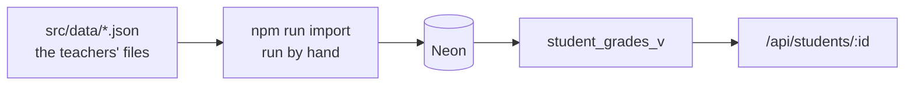
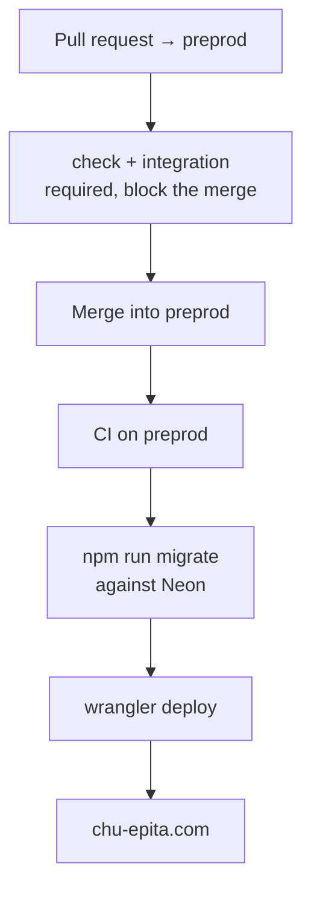

# Architecture

What runs where, and what talks to what. The reasoning behind each choice lives
in `docs/adr/`; this file is the map, not the argument.

## Runtime

`chu-epita.com` is a custom domain on the Worker and serves `preprod`, the
branch the CI deploys. `chu-epita.xyz` still answers from GitHub Pages and is
left untouched on purpose: it is the rollback, and it costs nothing as long as
nobody touches `master`. It is redirected when the V1 is validated.

Static assets are matched before the Worker runs, so they cost no invocation.
`run_worker_first` keeps `/api/*` out of the single-page-application fallback —
without it an API call would be answered with `index.html`.

## The pieces

| | What it is | Where it lives |
| --- | --- | --- |
| Screens | React 19 + Vite, built to static files | `src/`, served by the Worker |
| Grade formula | Pure, no framework, unit-tested | `src/lib/grades.js` |
| API client | `fetch` wrapper and loading hook | `src/api/` |
| API | Three read endpoints, all on `student_grades_v` | `worker/index.js` |
| Database access | `pg` through a Hyperdrive binding | ADR-0003, ADR-0006 |
| Schema | Numbered `.sql` migrations, applied in order | `src/db/migrations/` |
| Import | Reads `src/data/`, idempotent, one transaction | `src/db/import.js` |

## Where the grades come from

The JSON files under `src/data/` are the reference import format, not the source
the site reads: since BDD-31 nothing in the application imports them, and they
no longer reach the bundle. `npm run import` is run from a workstation, not by
the CI — a full import takes about two minutes against Neon, and loading grades
is a deliberate act, not something a merge should do.

`student_grades_v` is the only object the API reads. Published assessment,
nothing archived: the rule is in the view so no endpoint can forget it. The
teacher area, when it exists, will read the tables and see everything.

## Delivery

`check` is lint plus unit tests and needs nothing running. `integration` starts
a `postgres:18-alpine` service — the same major version as `docker-compose.yml`,
so a migration that passes on a laptop is the one the runner applies.

The schema goes before the code, and a failing migration publishes nothing. The
reverse case is not covered by ordering: a migration that removes what the live
Worker still reads breaks production for the seconds between the two steps. A
destructive change therefore takes two releases — add the new shape, publish the
code that stopped using the old one, drop it later.

`master` and `preprod` both require a pull request, `preprod` additionally
requires both checks, and neither accepts a force push. Nobody is exempt,
including administrators.

## Not there yet

- **No authentication.** Knowing a student number is enough to read that
  student's grades. Better than a bundle that hands every grade to every
  visitor, worse than a login, and acceptable only as an intermediate state.
- **The teacher area does not exist** — no writing path, so the `grade_audit`
  trigger currently only ever records imports.
- **`chu-epita.xyz` still serves the old site**, grades included, until the
  redirect lands.

## Where to read further

`docs/adr/0002` for the branches, `0003` for SQL over an ORM, `0004` for the
local database, `0006` for the hosting, the domain and where the data lives.
`docs/database.md` for the schema, `docs/testing.md` for what blocks a merge.
