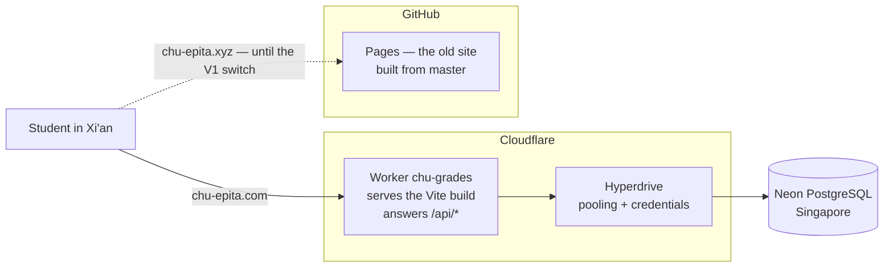
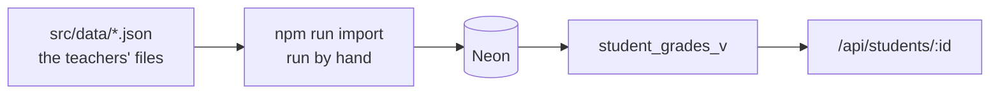
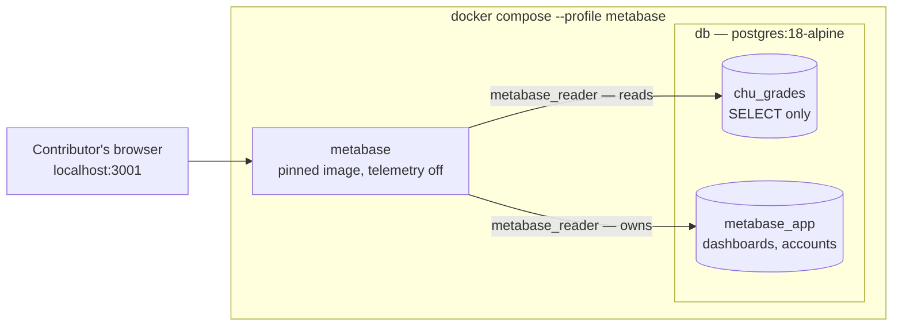
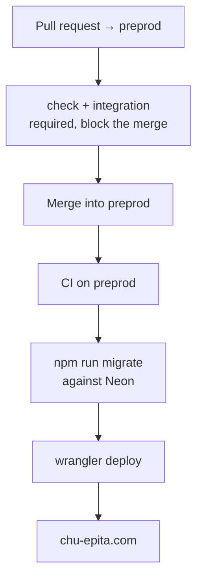

# Architecture

What runs where, and what talks to what. The reasoning behind each choice lives
in `docs/adr/`; this file is the map, not the argument.

## Runtime

`chu-epita.com` is a custom domain on the Worker and serves `preprod`, the
branch the CI deploys. `chu-epita.xyz` still answers from GitHub Pages and is
left untouched on purpose: it is the rollback, and it costs nothing as long as
nobody touches `master`. It is redirected when the V1 is validated.

`www.chu-epita.com` redirects to the apex with a 301, query string preserved.
That redirect is **not in this repository**: it is a Cloudflare Redirect Rule
named "Redirect www to apex", paired with a proxied `AAAA www 100::` record —
the documented address for a hostname that exists only to be redirected, so
nothing listens behind it and the request is answered at the edge.

It is dashboard configuration, which is the reason it is written down here. A
Worker-side redirect was considered and rejected: `run_worker_first` matches
paths, never hostnames, so catching `www` in the Worker would mean running it
on every request — every script, every stylesheet, every image — and serving
the assets from code. That is a large change to the shape of the application in
exchange for a redirect.

Static assets are matched before the Worker runs, so they cost no invocation.
`run_worker_first` keeps `/api/*` out of the single-page-application fallback —
without it an API call would be answered with `index.html`.

## The pieces

| | What it is | Where it lives |
| --- | --- | --- |
| Screens | React 19 + Vite, built to static files | `src/`, served by the Worker |
| Grade formula | Pure, no framework, unit-tested | `src/lib/grades.js` |
| API client | `fetch` wrapper and loading hook | `src/api/` |
| API | Three read endpoints, all on `student_grades_v` | `worker/index.js` |
| Database access | `pg` through a Hyperdrive binding | ADR-0003, ADR-0006 |
| Schema | Numbered `.sql` migrations, applied in order | `src/db/migrations/` |
| Import | Reads `src/data/`, idempotent, one transaction | `src/db/import.js` |
| Local analytics | Metabase, optional, read-only, never hosted | `docker compose --profile metabase` |

## Where the grades come from

The JSON files under `src/data/` are the reference import format, not the source
the site reads: since BDD-31 nothing in the application imports them, and they
no longer reach the bundle. `npm run import` is run from a workstation, not by
the CI — a full import takes about two minutes against Neon, and loading grades
is a deliberate act, not something a merge should do.

`student_grades_v` is the only object the API reads. Published assessment,
nothing archived: the rule is in the view so no endpoint can forget it. The
teacher area, when it exists, will read the tables and see everything.

## Reading the grades directly

Metabase is an optional Compose service — `profiles: ["metabase"]`, so
`docker compose up` does not start it — that answers questions about the grades
by promotion, course and assessment without any of it being added to the
application.

It sits beside the application, not inside it: nothing in `src/` or `worker/`
knows it exists, and removing the service removes the feature.

Two properties are deliberate. **It cannot write a grade** — `metabase_reader`
holds `CONNECT`, `USAGE` and `SELECT` and nothing else, so the refusal comes
from PostgreSQL rather than from trusting a tool nobody here wrote.
`tests/integration/metabase-reader.test.js` asserts it. **Its own state is in
PostgreSQL**, in a `metabase_app` database the same role owns, rather than in
the H2 file the image defaults to: owning a database grants nothing in any
other one, so one credential is read-only on the grades and still free to
write its dashboards next door — which is what makes them survive
`docker compose down`.

The role and that database are created by `npm run metabase:setup` and not by a
migration, because the role needs a password and a migration is a committed
`.sql` file with nowhere to put one. Production has neither: this is a
workstation tool.

**It is not open to teachers**, and nothing here hosts it. That is a separate
decision — it needs an authentication story the project does not have yet, and
it gets its own ADR when it is taken.

## Delivery

`check` is lint plus unit tests and needs nothing running. `integration` starts
a `postgres:18-alpine` service — the same major version as `docker-compose.yml`,
so a migration that passes on a laptop is the one the runner applies.

The schema goes before the code, and a failing migration publishes nothing. The
reverse case is not covered by ordering: a migration that removes what the live
Worker still reads breaks production for the seconds between the two steps. A
destructive change therefore takes two releases — add the new shape, publish the
code that stopped using the old one, drop it later.

`master` and `preprod` both require a pull request, `preprod` additionally
requires both checks, and neither accepts a force push. Nobody is exempt,
including administrators.

## Not there yet

- **No authentication.** Knowing a student number is enough to read that
  student's grades. Better than a bundle that hands every grade to every
  visitor, worse than a login, and acceptable only as an intermediate state.
- **The teacher area does not exist** — no writing path, so the `grade_audit`
  trigger currently only ever records imports.
- **`chu-epita.xyz` still serves the old site**, grades included, until the
  redirect lands.
- **No analytics for teachers.** Metabase runs on a contributor's machine
  only. A teacher who wants a figure asks for it.

## Where to read further

`docs/adr/0002` for the branches, `0003` for SQL over an ORM, `0004` for the
local database, `0006` for the hosting, the domain and where the data lives.
`docs/database.md` for the schema, `docs/testing.md` for what blocks a merge.
